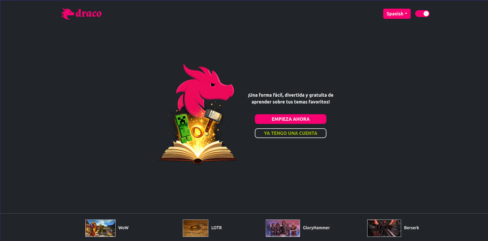
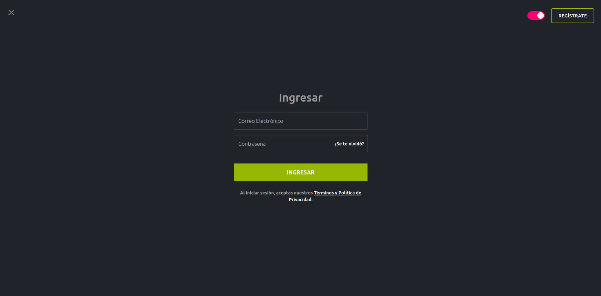
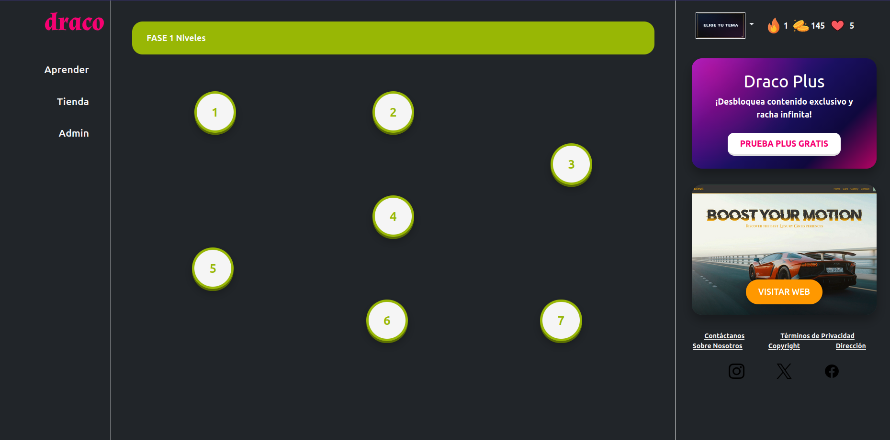
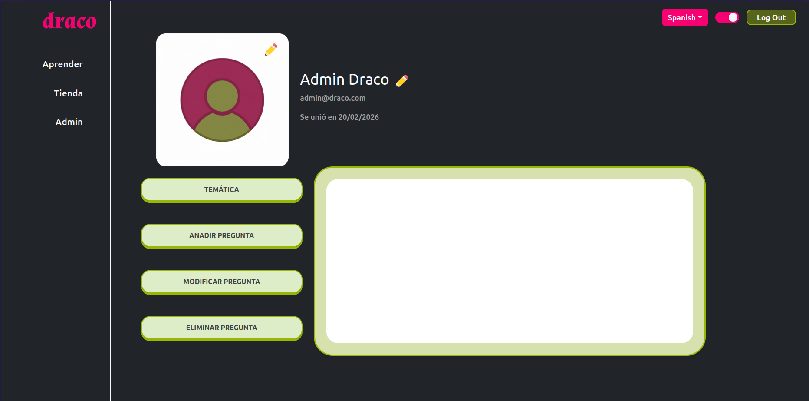

# DRACO

<a id="readme-top"></a>
[![Contributors][contributors-shield]][contributors-url] &nbsp;&nbsp;&nbsp;
[![branches][branches-shield]][branches-url] &nbsp;&nbsp;&nbsp;
[![Stargazers][stars-shield]][stars-url]

<div align="center">
  <a href="https://github.com/tu-usuario/tu-repo">
    
  </a>

  <h3 align="center">Draco</h3>

  <p align="center">
    The smartest and most visual way to learn what you are passionate about.
        <br />
    <a href="https://github.com/AR1UR0/Draco"><strong>Explore the docs »</strong></a>
    <br />
    <br />
</div>

<!-- Index -->
<details>
  <summary>Index</summary>
  <ol>
    <li>
      <a href="#project-overview">Project Overview</a>
    <ul>
      <li><a href="#key-features">Key Features</a></li>
    </ul>
    <li><a href="#stack--technologies">Stack & Technologies</a></li>
    <li>
      <a href="#getting-started">Getting Started</a>
      <ul>
        <li><a href="#prerequisites">Prerequisites</a></li>
        <li><a href="#installation-steps">Installation Steps</a></li>
      </ul>
    </li>
    <li><a href="#docker-deployment">Docker Deployment</a></li>
    <li><a href="#project-structure">Project Structure</a></li>
    <li><a href="#screenshots">Screenshots</a></li>
    <li><a href="#contacts">Contacts</a></li>
  </ol>
</details>

## Project Overview

DRACO is a full-stack educational platform built with Laravel designed to centralize learning about fantasy universes and video games through an interactive and gamified interface.

### Key Features

- **User Authentication:** Secure login and registration system for personalized user sessions.
- **Gamified Learning:** System of lives and progress tracking to encourage engagement.
- **Dynamic Content:** Data-driven architecture using **JSON** for dynamic question and lesson loading.
- **Draco Plus:** Premium subscription model for enhanced features.
- **Multi-Universe:** Specialized modules for _Lord of the Rings, Gloryhammer, Berserk, Mythology_, and more.
- **Responsive Design:** Fully accessible from any device via browser.

<p align="right">(<a href="#readme-top">back to top</a>)</p>

## Stack & Technologies

- [![HTML5][HTML5.com]][HTML5-url]
- [![SCSS][SCSS.com]][SCSS-url]
- [![JavaScript][JS.com]][JS-url]
- [![PHP][PHP.com]][PHP-url]
- [![Laravel][Laravel.com]][Laravel-url]
- [![MySQL][MySQL.com]][MySQL-url]
- [![Bootstrap][Bootstrap.com]][Bootstrap-url]
- [![Docker][Docker.com]][Docker-url]
- [![Docker Compose][DockerCompose.com]][DockerCompose-url]
- [![Apache][Apache.com]][Apache-url]

<p align="right">(<a href="#readme-top">back to top</a>)</p>

## Getting Started

Follow these steps to set up the project locally.

### Prerequisites

- **PHP:** version 8.3.6
- **Composer:** version 2.9.2
- **Node.js:** version 18.19.1
- **Docker:** version 28.2.2
- **Compose:** version version 1.29.2
- **MySQL:** version 9.6

### Installation Steps

1. **Clone the repo:**

   ```bash
   git clone [https://github.com/AR1UR0/Draco.git](https://github.com/AR1UR0/Draco.git)
   cd Draco
   ```

1. **Install dependencies:**

   ```bash
   composer install
   npm install && npm run build
   ```

1. **Install dependencies:**

   ```bash
   cp .env.example .env
   # Configure your database credentials in the .env file
   php artisan key:generate
   ```

1. **Database Setup:**

   Run migrations and seeders to populate the platform with the initial questions (loaded from JSON):

   ```bash
   php artisan migrate:fresh --seed
   ```

<p align="right">(<a href="#readme-top">back to top</a>)</p>

## Docker Deployment

The project is fully containerized using **Docker Compose**, featuring a pre-configured stack with Apache, PHP 8.3.6, MySQL 9.6, and phpMyAdmin.

### Deployment Steps

1. **Prepare SSL Certificates:**
   Ensure you have `server.crt` and `server.key` inside the `./ssl/` directory.

2. **Launch the environment:**
   Build and start the services in detached mode:
   ```bash
   docker compose up -d --build
   ```
3. **Initialize the Database:**
   Once the containers are healthy, run the migrations and seeders inside the PHP container:
   ```bash
   docker exec -it <container_id_or_name> php artisan migrate --seed
   ```
4. **Access URLs:**

- Application (HTTPS): https://localhost
- Application (HTTP): http://localhost

<p align="right">(<a href="#readme-top">back to top</a>)</p>

## Project Structure

This project follows the standard **Laravel MVC** architecture. Below are the key directories specific to Draco's functionality:

- **`database/data/json/`**: The core of our content. Contains all the raw data, questions, and lessons for the different universes.
- **`app/Http/Controllers/`**: Contains the backend logic, including the gamification engine (life system) and user management.
- **`resources/views/`**: All the UI components and Blade templates that build the visual experience.
- **`public/media/`**: Stores all global assets, icons, and specific imagery for the universes (LOTR, Star Wars, etc.).
- **`routes/`**: Definition of all web and API endpoints for the platform.

<p align="right">(<a href="#readme-top">back to top</a>)</p>

## Screenshots

Capture the visual essence of the Draco platform. Below are some previews of the current interface:

### Index Page

This is the primary entry point of the application, providing users with a high-level overview or the initial landing experience.

- **File:** `index.blade.php`

  

### Login Interface

User authentication screen featuring credential validation and secure access.

- **File:** `login.blade.php`

  

---

### Main / Home

The central navigation hub for the end-user after authentication.

- **File:** `pagPrincipal.blade.php`

  

---

### Admin Control Panel

Administrative module for system-wide resource management and oversight.

- **File:** `admin.blade.php`
  

<p align="right">(<a href="#readme-top">back to top</a>)</p>

## CONTACTS

Project Link: [https://github.com/AR1UR0/Draco](https://github.com/AR1UR0/Draco)

- LINKEDIN MARTA: [https://www.linkedin.com/in/marta-clemente-collado-6616b227b/](https://www.linkedin.com/in/marta-clemente-collado-6616b227b/)
- LINKEDIN ARTURO: [https://www.linkedin.com/in/arturo-ortiz-l%C3%B3pez-a323152aa/](https://www.linkedin.com/in/arturo-ortiz-l%C3%B3pez-a323152aa/)
- LINKEDIN THAIS: [www.linkedin.com/in/thais-nuñez-agullo-93840019a](www.linkedin.com/in/thais-nuñez-agullo-93840019a)

### Contributors:

<a href="https://github.com/AR1UR0/Draco/graphs/contributors">
  
</a>

<p align="right">(<a href="#readme-top">back to top</a>)</p>

<!-- MARKDOWN LINKS & IMAGES -->

[contributors-shield]: https://img.shields.io/github/contributors/AR1UR0/Draco.svg?style=for-the-badge
[contributors-url]: https://github.com/AR1UR0/Draco/graphs/contributors
[branches-shield]: https://img.shields.io/badge/ramas-100%2B-blue?style=for-the-badge&logo=git
[branches-url]: https://github.com/AR1UR0/Draco/branches
[stars-shield]: https://img.shields.io/github/stars/AR1UR0/Draco.svg?style=for-the-badge
[stars-url]: https://github.com/AR1UR0/Draco/stargazers
[Laravel.com]: https://img.shields.io/badge/Laravel-FF2D20?style=for-the-badge&logo=laravel&logoColor=white
[Laravel-url]: https://laravel.com
[Bootstrap.com]: https://img.shields.io/badge/Bootstrap-563D7C?style=for-the-badge&logo=bootstrap&logoColor=white
[Bootstrap-url]: https://getbootstrap.com
[HTML5.com]: https://img.shields.io/badge/HTML5-E34F26?style=for-the-badge&logo=html5&logoColor=white
[HTML5-url]: https://developer.mozilla.org/es/docs/Web/HTML
[SCSS.com]: https://img.shields.io/badge/Sass-CC6699?style=for-the-badge&logo=sass&logoColor=white
[SCSS-url]: https://sass-lang.com
[JS.com]: https://img.shields.io/badge/JavaScript-F7DF1E?style=for-the-badge&logo=javascript&logoColor=black
[JS-url]: https://developer.mozilla.org/es/docs/Web/JavaScript
[PHP.com]: https://img.shields.io/badge/PHP-777BB4?style=for-the-badge&logo=php&logoColor=white
[PHP-url]: https://www.php.net
[MySQL.com]: https://img.shields.io/badge/MySQL-4479A1?style=for-the-badge&logo=mysql&logoColor=white
[MySQL-url]: https://www.mysql.com
[Docker.com]: https://img.shields.io/badge/Docker-2496ED?style=for-the-badge&logo=docker&logoColor=white
[Docker-url]: https://www.docker.com
[Apache.com]: https://img.shields.io/badge/Apache-D22128?style=for-the-badge&logo=apache&logoColor=white
[Apache-url]: https://httpd.apache.org/
[DockerCompose.com]: https://img.shields.io/badge/Docker_Compose-2496ED?style=for-the-badge&logo=docker&logoColor=white
[DockerCompose-url]: https://docs.docker.com/compose/
